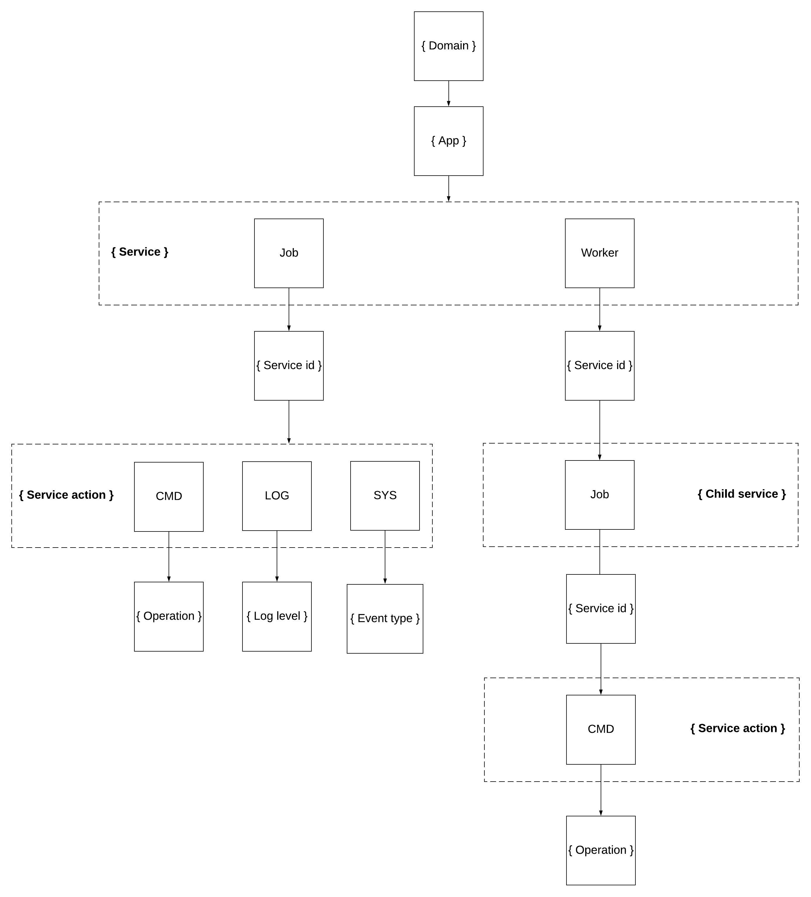

# sdkperf-toolkit

A toolkit for running and managing distributed sdkperf processes.

Table of Contents

- [Architecture](#architecture)
- [Topic Hierarchy](#topic-hierarchy)

## Architecture

## Topic Hierarchy

